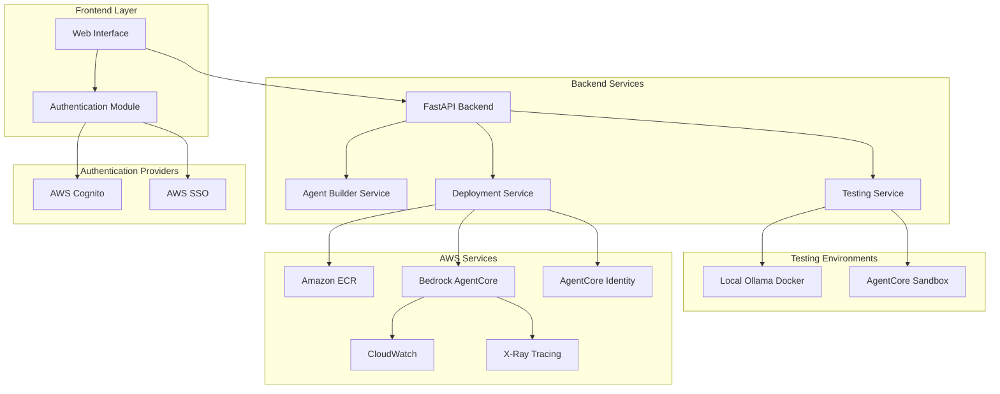

# Design Document

## Overview

The AWS AgentCore Deployment System is a comprehensive platform that enables developers to build, test, and deploy AI agents to AWS Bedrock AgentCore Runtime with integrated authentication. The system provides a seamless workflow from agent creation through testing to production deployment, supporting multiple authentication providers and testing environments.

## Architecture

### High-Level Architecture



### Component Architecture

The system follows a modular architecture with clear separation of concerns:

1. **Frontend Layer**: React-based web interface with TypeScript
2. **Backend Services**: FastAPI-based microservices architecture
3. **Authentication Layer**: Multi-provider authentication with JWT tokens
4. **Testing Layer**: Dual-environment testing (local and cloud)
5. **Deployment Layer**: Automated AWS resource provisioning and deployment

## Components and Interfaces

### 1. Authentication System

**Purpose**: Handle multi-provider authentication and session management

**Key Components**:
- `CognitoAuthHandler`: Manages AWS Cognito authentication flows
- `SSOAuthHandler`: Handles AWS SSO integration
- `JWTManager`: Token validation and refresh logic
- `SessionManager`: User session state management

**Interfaces**:
```typescript
interface AuthProvider {
  authenticate(credentials: AuthCredentials): Promise<AuthResult>
  refreshToken(token: string): Promise<string>
  validateToken(token: string): Promise<UserInfo>
  logout(sessionId: string): Promise<void>
}

interface UserInfo {
  id: string
  email: string
  provider: 'cognito' | 'sso'
  awsCredentials?: AWSCredentials
  capabilities: UserCapabilities
}
```

### 2. Agent Builder Service

**Purpose**: Create and configure Strands agents with comprehensive model and tool support

**Key Components**:
- `AgentConfigBuilder`: Generate agent configurations with full tool integration
- `ModelSelector`: Handle all supported model types (Ollama, Bedrock, OpenAI, Anthropic, Google, Cohere)
- `ToolIntegrator`: Manage comprehensive tool configurations and dependencies
- `CodeGenerator`: Generate optimized Strands agent code with all tools
- `DependencyManager`: Handle complex tool dependency resolution

**Supported Models**:
- **Ollama Models**: Local deployment with Docker containers
- **AWS Bedrock**: Claude, Titan, Jurassic, Command models
- **OpenAI**: GPT-4, GPT-3.5-turbo, GPT-4-turbo, GPT-4o
- **Anthropic**: Claude-3 (Opus, Sonnet, Haiku), Claude-3.5
- **Google**: Gemini Pro, Gemini Ultra, PaLM 2
- **Cohere**: Command, Command-Light, Command-Nightly

**Supported Tools Categories**:
- **Memory Tools**: mem0_memory, vector databases (Chroma, Pinecone, Weaviate, Qdrant)
- **Browser Tools**: local_chromium_browser, agent_core_browser, Playwright, Selenium
- **Code Tools**: agent_core_code_interpreter, Docker execution, Jupyter notebooks
- **Communication**: a2a_client, Slack SDK, Discord, Twilio, SendGrid
- **Data Processing**: pandas, numpy, matplotlib, seaborn, plotly
- **Document Processing**: PDF, Word, Excel, PowerPoint, Markdown
- **Web Scraping**: BeautifulSoup, Scrapy, RSS feeds, newspaper3k
- **Image Processing**: Pillow, OpenCV, image generation
- **Audio Processing**: speech recognition, Whisper, audio manipulation
- **Database Tools**: SQL, MongoDB, Redis, vector databases
- **Diagram Tools**: Mermaid, Graphviz, network diagrams
- **Computer Vision**: use_computer, screen capture, automation

**Interfaces**:
```python
class AgentConfig:
    name: str
    description: str
    model_type: str  # 'ollama' | 'bedrock' | 'openai' | 'anthropic' | 'google' | 'cohere'
    model_id: str
    model_parameters: Dict[str, Any]
    system_prompt: str
    tools: List[ToolConfig]
    memory_config: Optional[MemoryConfig]
    environment_variables: Dict[str, str]
    resource_limits: ResourceLimits
    security_settings: SecurityConfig

class ToolConfig:
    name: str
    type: str  # Category of tool
    provider: str  # Tool provider/source
    configuration: Dict[str, Any]
    dependencies: List[str]
    resource_requirements: ResourceRequirements
    security_permissions: List[str]

class MemoryConfig:
    provider: str  # 'mem0' | 'chroma' | 'pinecone' | 'weaviate' | 'qdrant'
    configuration: Dict[str, Any]
    embedding_model: str
    vector_dimensions: int
    persistence_settings: Dict[str, Any]

class ResourceLimits:
    max_memory_mb: int
    max_cpu_cores: float
    max_execution_time_seconds: int
    max_storage_mb: int
    network_access: bool
```

### 3. Testing Service

**Purpose**: Provide comprehensive testing environments for all agent types and tools

**Key Components**:
- `OllamaTestRunner`: Execute agents in local Docker containers with full tool support
- `AgentCoreSandboxRunner`: Deploy to temporary AgentCore environments with AWS integration
- `LocalTestRunner`: Run agents locally with Docker isolation
- `CloudTestRunner`: Execute in cloud environments with scaling
- `TestResultAnalyzer`: Comprehensive analysis of test results and performance
- `EnvironmentManager`: Manage complex testing environment lifecycle
- `ToolTestValidator`: Validate individual tool functionality
- `IntegrationTestRunner`: Test multi-tool agent workflows

**Testing Environments**:
- **Local Ollama Docker**: Full isolation with all tools, local models
- **AgentCore Sandbox**: AWS-hosted testing with Bedrock models
- **Hybrid Testing**: Local tools with cloud models
- **Performance Testing**: Load testing and benchmarking
- **Security Testing**: Isolated security validation

**Tool Testing Support**:
- **Memory Tools**: Vector database connectivity and performance
- **Browser Tools**: Web scraping and automation validation
- **Code Execution**: Safe code execution in sandboxed environments
- **API Integration**: Third-party service connectivity testing
- **Database Tools**: Connection and query validation
- **File Processing**: Document and media processing validation

**Interfaces**:
```python
class TestEnvironment:
    environment_id: str
    name: str
    description: str
    supports_models: List[str]
    supports_tools: List[str]
    cost_model: str
    performance_tier: str
    isolation_level: str
    resource_limits: ResourceLimits
    network_access: NetworkConfig
    storage_config: StorageConfig

class TestResult:
    success: bool
    response: str
    execution_time: float
    memory_usage: float
    cpu_usage: float
    network_usage: Dict[str, int]
    logs: List[LogEntry]
    metrics: Dict[str, Any]
    errors: List[ErrorDetail]
    tool_performance: Dict[str, ToolMetrics]
    security_validation: SecurityTestResult

class ToolMetrics:
    tool_name: str
    execution_time: float
    success_rate: float
    error_count: int
    resource_usage: ResourceUsage
    api_calls: int
    data_processed: int

class SecurityTestResult:
    passed: bool
    vulnerabilities: List[SecurityIssue]
    permissions_validated: bool
    data_isolation_verified: bool
    network_security_checked: bool
```

### 4. Deployment Service

**Purpose**: Automate comprehensive AWS resource provisioning and agent deployment with full tool support

**Key Components**:
- `DockerfileGenerator`: Create optimized Dockerfiles with all tool dependencies
- `CloudFormationGenerator`: Generate comprehensive infrastructure templates
- `CDKGenerator`: Create TypeScript/Python CDK scripts for infrastructure
- `ECRManager`: Handle container registry operations with multi-architecture support
- `AgentCoreDeployer`: Deploy to Bedrock AgentCore Runtime with full configuration
- `ResourceProvisioner`: Provision all required AWS resources (VPC, IAM, etc.)
- `DependencyResolver`: Handle complex tool dependency installation
- `SecurityConfigurator`: Set up comprehensive security policies
- `MonitoringSetup`: Configure complete observability stack

**Deployment Capabilities**:
- **Multi-Architecture Support**: ARM64 and x86_64 container builds
- **Tool Dependencies**: Automatic installation of all tool requirements
- **Database Provisioning**: RDS, DynamoDB, ElastiCache setup
- **Network Configuration**: VPC, subnets, security groups
- **IAM Role Management**: Least-privilege access policies
- **Secret Management**: AWS Secrets Manager integration
- **Load Balancing**: Application Load Balancer configuration
- **Auto Scaling**: Horizontal and vertical scaling policies
- **Backup Configuration**: Automated backup strategies

**Infrastructure Components**:
- **Compute**: AgentCore Runtime, Lambda functions, ECS tasks
- **Storage**: S3 buckets, EFS file systems, EBS volumes
- **Databases**: RDS instances, DynamoDB tables, ElastiCache clusters
- **Networking**: VPC, subnets, NAT gateways, security groups
- **Security**: IAM roles, KMS keys, Secrets Manager
- **Monitoring**: CloudWatch, X-Ray, Application Insights
- **CDN**: CloudFront distributions for static assets

**Interfaces**:
```python
class DeploymentConfig:
    agent_config: AgentConfig
    aws_region: str
    availability_zones: List[str]
    ecr_repository: str
    vpc_config: VPCConfig
    runtime_settings: RuntimeSettings
    identity_config: IdentityConfig
    monitoring_config: MonitoringConfig
    scaling_config: ScalingConfig
    security_config: SecurityConfig
    backup_config: BackupConfig
    tool_configurations: Dict[str, ToolDeploymentConfig]

class DeploymentResult:
    success: bool
    agent_arn: str
    endpoint_url: str
    version: str
    deployment_logs: List[str]
    infrastructure_resources: Dict[str, str]
    monitoring_dashboards: List[str]
    security_policies: List[str]
    estimated_costs: CostEstimate
    performance_benchmarks: PerformanceMetrics

class ToolDeploymentConfig:
    tool_name: str
    resource_requirements: ResourceRequirements
    security_permissions: List[str]
    network_access: NetworkRequirements
    storage_requirements: StorageRequirements
    environment_variables: Dict[str, str]
    secrets: List[str]
```

### 5. Identity Management Service

**Purpose**: Configure AgentCore Identity for authentication and authorization

**Key Components**:
- `InboundAuthConfigurator`: Set up OAuth 2.0 for agent access
- `OutboundAuthManager`: Configure third-party service authentication
- `TokenValidator`: Validate and process JWT tokens
- `PermissionManager`: Manage user permissions and capabilities

## Data Models

### User Management
```python
class User:
    id: str
    email: str
    provider: AuthProvider
    aws_account_id: Optional[str]
    cognito_user_pool_id: Optional[str]
    capabilities: UserCapabilities
    created_at: datetime
    last_login: datetime

class UserCapabilities:
    can_deploy_to_aws: bool
    can_use_bedrock_testing: bool
    can_use_ollama_testing: bool
    can_save_agents: bool
    deployment_options: List[str]
    aws_regions: List[str]
```

### Agent Configuration
```python
class Agent:
    id: str
    user_id: str
    name: str
    description: str
    config: AgentConfig
    status: AgentStatus
    created_at: datetime
    updated_at: datetime
    deployment_info: Optional[DeploymentInfo]

class DeploymentInfo:
    agent_arn: str
    endpoint_url: str
    version: str
    region: str
    status: DeploymentStatus
    deployed_at: datetime
```

### Testing and Monitoring
```python
class TestSession:
    id: str
    agent_id: str
    environment: TestEnvironment
    status: TestStatus
    results: List[TestResult]
    created_at: datetime
    completed_at: Optional[datetime]

class MonitoringData:
    agent_id: str
    metrics: Dict[str, float]
    logs: List[LogEntry]
    traces: List[TraceData]
    timestamp: datetime
```

## Error Handling

### Error Categories
1. **Authentication Errors**: Invalid credentials, expired tokens, permission denied
2. **Configuration Errors**: Invalid agent configurations, missing dependencies
3. **Testing Errors**: Environment unavailable, test execution failures
4. **Deployment Errors**: AWS service failures, resource conflicts, permission issues
5. **Runtime Errors**: Agent execution failures, timeout errors, resource exhaustion

### Error Response Format
```python
class ErrorResponse:
    error_code: str
    message: str
    details: Dict[str, Any]
    suggestions: List[str]
    retry_after: Optional[int]
    support_reference: str
```

### Retry and Recovery Strategies
- **Exponential Backoff**: For transient AWS service errors
- **Circuit Breaker**: For external service dependencies
- **Graceful Degradation**: Fallback to alternative testing environments
- **Automatic Rollback**: For failed deployments

## Testing Strategy

### Unit Testing
- **Authentication Components**: Mock external auth providers
- **Agent Builder**: Validate configuration generation
- **Deployment Logic**: Test infrastructure template generation
- **Error Handling**: Verify error scenarios and recovery

### Integration Testing
- **End-to-End Workflows**: Complete agent creation to deployment
- **AWS Service Integration**: Test actual AWS service interactions
- **Authentication Flows**: Verify OAuth 2.0 and JWT handling
- **Multi-Environment Testing**: Validate both Ollama and AgentCore testing

### Performance Testing
- **Load Testing**: Multiple concurrent agent deployments
- **Stress Testing**: Resource limits and error conditions
- **Latency Testing**: Response times for critical operations
- **Scalability Testing**: System behavior under increasing load

### Security Testing
- **Authentication Security**: Token validation and session management
- **Authorization Testing**: User permission enforcement
- **Input Validation**: Prevent injection attacks and malformed data
- **AWS Security**: IAM roles and resource access controls

## Comprehensive Strands Agents Tool Support

### RAG & Memory Tools
- **retrieve**: Semantically retrieve data from Amazon Bedrock Knowledge Bases for RAG, memory, and other purposes
- **memory**: Agent memory persistence in Amazon Bedrock Knowledge Bases
- **agent_core_memory**: Integration with Amazon Bedrock Agent Core Memory
- **mem0_memory**: Agent memory and personalization built on top of Mem0

### File Operations Tools
- **editor**: File editing operations like line edits, search, and undo
- **file_read**: Read and parse files
- **file_write**: Create and modify files

### Shell & System Tools
- **environment**: Manage environment variables
- **shell**: Execute shell commands
- **cron**: Task scheduling with cron jobs
- **use_computer**: Automate desktop actions and GUI interactions

### Code Interpretation Tools
- **python_repl**: Run Python code (not supported on Windows due to fcntl module)
- **code_interpreter**: Execute code in isolated sandboxes
- **agent_core_code_interpreter**: Cloud-based code execution with AgentCore

### Web & Network Tools
- **http_request**: Make API calls, fetch web data, and call local HTTP servers
- **slack**: Slack integration with real-time events, API access, and message sending
- **browser**: Automate web browser interactions
- **local_chromium_browser**: Local Chrome/Chromium browser automation
- **agent_core_browser**: Cloud-based browser automation through AgentCore
- **rss**: Manage and process RSS feeds

### Multi-modal Tools
- **generate_image_stability**: Create images with Stability AI
- **image_reader**: Process and analyze images
- **generate_image**: Create AI generated images with Amazon Bedrock
- **nova_reels**: Create AI generated videos with Nova Reels on Amazon Bedrock
- **speak**: Generate speech from text using macOS say command or Amazon Polly
- **diagram**: Create cloud architecture and UML diagrams

### AWS Services Tools
- **use_aws**: Interact with AWS services

### Utility Tools
- **calculator**: Perform mathematical operations
- **current_time**: Get the current date and time
- **load_tool**: Dynamically load more tools at runtime
- **sleep**: Pause execution with interrupt support

### Agents & Workflows Tools
- **graph**: Create and manage multi-agent systems using Strands SDK Graph implementation
- **agent_graph**: Create and manage graphs of agents
- **journal**: Create structured tasks and logs for agents to manage and work from
- **swarm**: Coordinate multiple AI agents in a swarm/network of agents
- **stop**: Force stop the agent event loop
- **handoff_to_user**: Enable human-in-the-loop workflows by pausing agent execution for user input
- **use_agent**: Run a new AI event loop with custom prompts and different model providers
- **think**: Perform deep thinking by creating parallel branches of agentic reasoning
- **use_llm**: Run a new AI event loop with custom prompts
- **workflow**: Orchestrate sequenced workflows
- **batch**: Call multiple tools from a single model request
- **a2a_client**: Enable agent-to-agent communication

### Tool Categories by Installation Requirements

**Base Tools** (included with strands-agents-tools):
- retrieve, memory, agent_core_memory, editor, file_read, file_write, environment, shell, cron, python_repl, code_interpreter, http_request, slack, browser, generate_image_stability, image_reader, generate_image, nova_reels, speak, use_aws, calculator, current_time, load_tool, sleep, graph, agent_graph, journal, swarm, stop, handoff_to_user, use_agent, think, use_llm, workflow, batch

**Tools Requiring Extra Dependencies**:
- **mem0_memory**: `pip install 'strands-agents-tools[mem0_memory]'`
- **local_chromium_browser**: `pip install 'strands-agents-tools[local_chromium_browser]'`
- **agent_core_browser**: `pip install 'strands-agents-tools[agent_core_browser]'`
- **agent_core_code_interpreter**: `pip install 'strands-agents-tools[agent_core_code_interpreter]'`
- **a2a_client**: `pip install 'strands-agents-tools[a2a_client]'`
- **diagram**: `pip install 'strands-agents-tools[diagram]'`
- **rss**: `pip install 'strands-agents-tools[rss]'`
- **use_computer**: `pip install 'strands-agents-tools[use_computer]'`

### Supporting Infrastructure Tools
- **Vector Databases**: ChromaDB, Pinecone, Weaviate, Qdrant, Redis (for memory tools)
- **Web Automation**: Selenium, Playwright, BeautifulSoup (supporting browser tools)
- **Data Processing**: pandas, numpy, matplotlib, scipy (supporting analysis tools)
- **Document Processing**: PyPDF2, python-docx, openpyxl (supporting file tools)
- **Image Processing**: Pillow, OpenCV (supporting image tools)
- **Audio Processing**: pydub, speech-recognition (supporting speak tool)
- **Communication**: slack-sdk, discord.py, twilio (supporting communication tools)
- **Monitoring**: OpenTelemetry, LangSmith, CloudWatch, X-Ray (for observability)

## Deployment Architecture

### Infrastructure Components
```yaml
# CloudFormation Template Structure
Resources:
  ECRRepository:
    Type: AWS::ECR::Repository
    Properties:
      RepositoryName: !Sub "${AgentName}-repository"
      
  AgentCoreRuntime:
    Type: AWS::BedrockAgentCore::Runtime
    Properties:
      Name: !Ref AgentName
      ContainerImage: !Sub "${ECRRepository.RepositoryUri}:latest"
      
  IdentityConfiguration:
    Type: AWS::BedrockAgentCore::Identity
    Properties:
      RuntimeArn: !Ref AgentCoreRuntime
      AuthenticationConfig: !Ref AuthConfig
      
  MonitoringRole:
    Type: AWS::IAM::Role
    Properties:
      AssumeRolePolicyDocument: !Ref TrustPolicy
      Policies: !Ref MonitoringPolicies
```

### Container Configuration
```dockerfile
# Generated Dockerfile Template
FROM python:3.11-slim

WORKDIR /app

COPY requirements.txt .
RUN pip install -r requirements.txt

COPY agent_code/ .
COPY config/ ./config/

EXPOSE 8080

CMD ["python", "agent_runtime.py"]
```

### Monitoring and Observability
- **CloudWatch Metrics**: Agent performance, request rates, error rates
- **X-Ray Tracing**: Request flow analysis and performance bottlenecks
- **Custom Dashboards**: Agent-specific monitoring views
- **Alerting**: Automated notifications for failures and performance issues

This design provides a robust, scalable, and secure platform for AWS AgentCore deployment with comprehensive testing and monitoring capabilities.