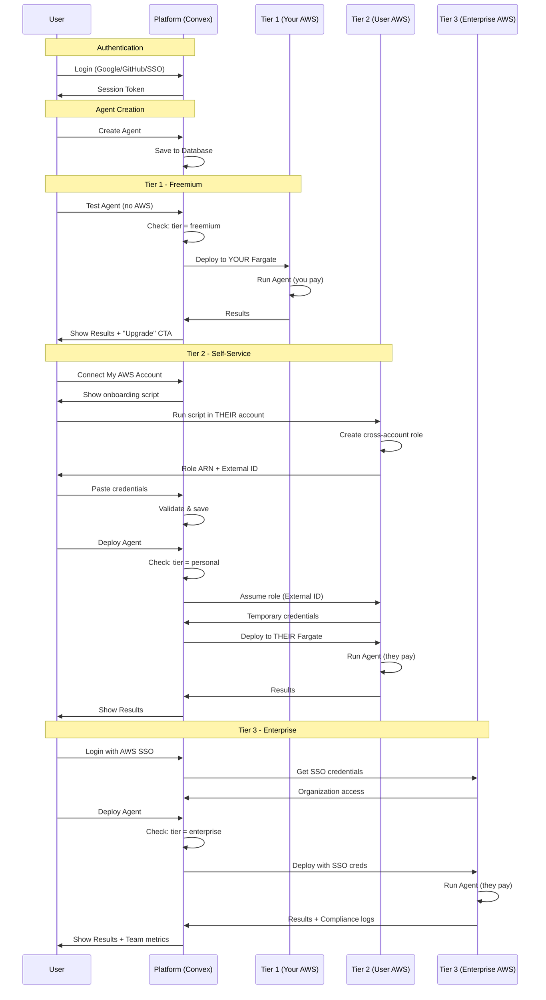

# AWS 3-Tier SaaS Architecture Diagram

## Complete System Architecture

```mermaid
graph TB
    subgraph "User Authentication Layer"
        User[👤 User] --> AuthChoice{Authentication Method}
        AuthChoice -->|Tier 1 & 2| GoogleAuth[🔍 Google OAuth]
        AuthChoice -->|Tier 1 & 2| GitHubAuth[🐙 GitHub OAuth]
        AuthChoice -->|Tier 3| AWSSSo[🔐 AWS SSO<br/>Enterprise]
        GoogleAuth --> ConvexAuth[⚡ Convex Auth]
        GitHubAuth --> ConvexAuth
        AWSSSo --> ConvexAuth
    end

    subgraph "Platform Layer - Your Infrastructure"
        ConvexAuth --> ConvexDB[(🗄️ Convex Database<br/>User Profiles<br/>Agent Definitions)]
        ConvexDB --> DeployRouter{Deployment Router<br/>Tier Detection}
    end

    subgraph "Tier 1: Freemium - YOUR AWS Account"
        DeployRouter -->|No AWS Account| Tier1[🆓 Tier 1 Deploy]
        Tier1 --> YourFargate[🚀 Your ECS Fargate<br/>Free Testing<br/>10 tests/month]
        YourFargate --> YourECR[📦 Your ECR<br/>Agent Images]
        YourFargate --> YourS3[🪣 Your S3<br/>Artifacts]
        YourFargate --> Bedrock[🤖 AWS Bedrock<br/>Claude Models]
        YourFargate --> YourLogs[📊 Your CloudWatch<br/>Logs & Metrics]
        
        YourCost[💰 You Pay<br/>~$60-100/month<br/>for 100 users]
    end

    subgraph "Tier 2: Self-Service - USER'S AWS Account"
        DeployRouter -->|Has AWS Account| Tier2[💼 Tier 2 Deploy]
        Tier2 --> AssumeRole[🔑 Assume Cross-Account Role<br/>External ID Security]
        AssumeRole --> UserFargate[🚀 User's ECS Fargate<br/>Their Infrastructure]
        UserFargate --> UserECR[📦 User's ECR<br/>Their Images]
        UserFargate --> UserS3[🪣 User's S3<br/>Their Artifacts]
        UserFargate --> UserBedrock[🤖 User's Bedrock<br/>Their API Calls]
        UserFargate --> UserLogs[📊 User's CloudWatch<br/>Their Logs]
        
        UserCost[💰 User Pays<br/>~$5-20/month<br/>their usage]
    end

    subgraph "Tier 3: Enterprise - ENTERPRISE AWS Organization"
        DeployRouter -->|Enterprise SSO| Tier3[🏢 Tier 3 Deploy]
        Tier3 --> SSOCreds[🔐 AWS SSO Credentials<br/>Organization Access]
        SSOCreds --> EntFargate[🚀 Enterprise ECS Fargate<br/>Organization Account]
        EntFargate --> EntECR[📦 Enterprise ECR<br/>Centralized Registry]
        EntFargate --> EntS3[🪣 Enterprise S3<br/>Compliance Storage]
        EntFargate --> EntBedrock[🤖 Enterprise Bedrock<br/>Volume Discounts]
        EntFargate --> EntLogs[📊 Enterprise CloudWatch<br/>Centralized Monitoring]
        
        EntCost[💰 Enterprise Pays<br/>Volume pricing<br/>their usage]
    end

    subgraph "User Onboarding - Tier 2 Setup"
        UserSetup[👤 User Runs Script] --> CreateRole[🔐 Create IAM Role<br/>Cross-Account Trust]
        CreateRole --> CreateVPC[🌐 Create VPC<br/>Networking]
        CreateVPC --> CreateECS[🚀 Create ECS Cluster]
        CreateECS --> ReturnCreds[📋 Return Role ARN<br/>& External ID]
        ReturnCreds --> UserPastes[👤 User Pastes in Platform]
    end

    subgraph "Security & Monitoring"
        YourFargate --> IAM1[🔒 IAM Roles<br/>Least Privilege]
        UserFargate --> IAM2[🔒 IAM Roles<br/>Scoped Access]
        EntFargate --> IAM3[🔒 IAM Roles<br/>Organization Policies]
        
        YourLogs --> Alarms[⚠️ Cost Alarms<br/>$50 threshold]
        UserLogs --> UserAlarms[⚠️ User Alarms<br/>Their budget]
        EntLogs --> EntAlarms[⚠️ Enterprise Alarms<br/>Compliance]
    end

    subgraph "Teardown - After Hackathon"
        TeardownScript[🗑️ Teardown Script] --> DeleteECS[❌ Delete ECS Clusters]
        DeleteECS --> DeleteECR[❌ Delete ECR Repos]
        DeleteECR --> DeleteS3[❌ Empty & Delete S3]
        DeleteS3 --> DeleteVPC[❌ Delete VPC Resources]
        DeleteVPC --> DeleteIAM[❌ Delete IAM Roles]
        DeleteIAM --> DeleteCognito[❌ Delete Cognito Pools]
        DeleteCognito --> DeleteLogs[❌ Delete CloudWatch Logs]
        DeleteLogs --> Complete[✅ Clean Shutdown<br/>$0 ongoing costs]
    end

    style User fill:#e1f5fe
    style Tier1 fill:#c8e6c9
    style Tier2 fill:#fff9c4
    style Tier3 fill:#f8bbd0
    style YourCost fill:#ffccbc
    style UserCost fill:#c5e1a5
    style EntCost fill:#ce93d8
    style TeardownScript fill:#ef9a9a
    style Complete fill:#a5d6a7
```



## Simplified Flow Diagram



## Infrastructure Components

### Scripts (Keep These 4)

1. **`setup-aws-infrastructure.ps1`** ✅
   - Sets up YOUR platform infrastructure
   - Creates Tier 1 resources
   - Enables cross-account access for Tier 2
   - One-time setup

2. **`user-aws-onboarding.ps1`** ✅
   - Users run in THEIR AWS account
   - Creates cross-account role
   - Sets up their infrastructure
   - Returns credentials

3. **`verify-aws-setup.ps1`** ✅
   - Verifies all resources are configured
   - Checks all 3 tiers
   - Validates permissions
   - Troubleshooting tool

4. **`teardown-aws-infrastructure.ps1`** ✅
   - Clean shutdown after hackathon
   - Deletes ALL project resources
   - Safe - only affects project resources
   - Prevents ongoing costs

### CloudFormation (Alternative for Tier 2)

5. **`cloudformation/user-onboarding-template.yaml`** ✅
   - One-click user onboarding
   - Alternative to PowerShell script
   - AWS Console friendly
   - Same result as script

## Cost Breakdown

### Tier 1 (Your Costs)
```
Monthly costs for 100 free users:
├── ECS Fargate: $40 (10 tests × 100 users × $0.04/hour)
├── Bedrock API: $20 (usage-based)
├── CloudWatch: $5 (logs & metrics)
├── ECR: $5 (image storage)
└── S3: $2 (artifacts)
─────────────────
Total: ~$72/month
```

### Tier 2 (User Pays)
```
Monthly costs per user:
├── ECS Fargate: $5-10 (their usage)
├── Bedrock API: $5-10 (their calls)
├── CloudWatch: $1 (their logs)
├── ECR: $1 (their images)
└── S3: $1 (their artifacts)
─────────────────
Total: ~$13-23/month per user
Your cost: $0
```

### Tier 3 (Enterprise Pays)
```
Monthly costs per organization:
├── ECS Fargate: $100-500 (team usage)
├── Bedrock API: $100-500 (volume discounts)
├── CloudWatch: $20 (centralized logs)
├── ECR: $10 (shared registry)
└── S3: $10 (compliance storage)
─────────────────
Total: ~$240-1,040/month
Your cost: $0
```

## Security Model

### Tier 1 Security
- ✅ Isolated Fargate tasks per user
- ✅ Resource limits (CPU, memory, time)
- ✅ Automatic cleanup after tests
- ✅ CloudWatch monitoring

### Tier 2 Security
- ✅ External ID prevents confused deputy
- ✅ Least-privilege IAM policies
- ✅ Scoped resource creation (`agent-builder-*`)
- ✅ User can revoke access anytime
- ✅ Audit trail in CloudWatch

### Tier 3 Security
- ✅ AWS SSO integration
- ✅ Organization-level policies
- ✅ Centralized access management
- ✅ Compliance controls (SOC2, HIPAA)

## Deployment Flow

### Tier 1 Deployment
```typescript
// User has no AWS account
if (user.tier === "freemium") {
  // Check usage limits
  if (testsThisMonth >= 10) {
    throw new Error("Upgrade to continue");
  }
  
  // Deploy to YOUR Fargate
  const result = await deployToYourFargate(agentId);
  
  // Show upgrade CTA
  return {
    result,
    message: "Upgrade to deploy to your AWS account"
  };
}
```

### Tier 2 Deployment
```typescript
// User has connected their AWS account
if (user.tier === "personal") {
  // Get their credentials
  const awsAccount = await getUserAWSAccount(userId);
  
  // Assume role in their account
  const credentials = await assumeRole({
    roleArn: awsAccount.roleArn,
    externalId: awsAccount.externalId
  });
  
  // Deploy to THEIR Fargate
  const result = await deployToTheirFargate(agentId, credentials);
  
  return result;
}
```

### Tier 3 Deployment
```typescript
// Enterprise user with AWS SSO
if (user.tier === "enterprise") {
  // Get SSO credentials
  const credentials = await getSSOCredentials(user.ssoToken);
  
  // Deploy to their organization
  const result = await deployToEnterprise(agentId, credentials);
  
  // Log for compliance
  await logEnterpriseDeployment(user.orgId, agentId);
  
  return result;
}
```

## Quick Reference

| Component | Purpose | Keep? |
|-----------|---------|-------|
| `setup-aws-infrastructure.ps1` | Setup YOUR platform | ✅ Keep |
| `user-aws-onboarding.ps1` | User connects THEIR AWS | ✅ Keep |
| `verify-aws-setup.ps1` | Verify all resources | ✅ Keep |
| `teardown-aws-infrastructure.ps1` | Clean shutdown | ✅ Keep |
| `cloudformation/user-onboarding-template.yaml` | Alternative onboarding | ✅ Keep |
| `verify-setup.ps1` | Old verification | ❌ Deleted |
| `check-app-config.ps1` | App-specific checks | ❌ Deleted |

## Next Steps

1. ✅ Scripts cleaned up (4 essential scripts)
2. ✅ Documentation updated
3. ✅ Architecture diagram created
4. 🔄 Ready to implement!

---

**Export to Draw.io**: Copy the Mermaid code above and paste into [Mermaid Live Editor](https://mermaid.live/), then export as PNG/SVG/PDF for Draw.io import.
